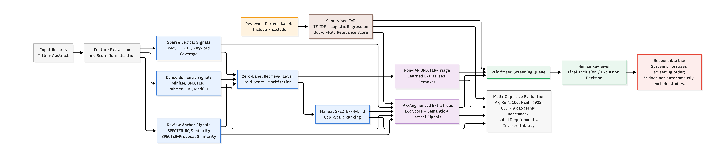

# SPECTER-Triage: Multi-Objective Evaluation of Semantic-Lexical Reranking for Biomedical Systematic Review Triage

SPECTER-Triage is a semantic-lexical reranking framework for biomedical systematic review triage. It combines sparse lexical retrieval signals and dense embedding signals with supervised reranking to prioritize records for human screening.

## Framework Flow

1. Prepare records and labels from screening data.
2. Generate lexical and semantic retrieval scores (BM25, TF-IDF, SPECTER-family, MiniLM, MedCPT, PubMedBERT).
3. Train a supervised reranker over these signals.
4. Produce a prioritized queue for human review and evaluate workload-recall tradeoffs.



## Start Here

Use these guides as the source of truth:

- Reproducibility (full pipeline, outputs, supplementary materials): [docs/reproducibility_guide.md](docs/reproducibility_guide.md)
- Application usage (FastAPI + Vue app): [docs/application_guide.md](docs/application_guide.md)

## Quick Setup

```bash
git clone <repository-url>
cd specter-literature-triage
python -m venv .venv
source .venv/bin/activate  # Linux/macOS
# .venv\Scripts\activate  # Windows
pip install -r requirements.txt
```

## Reproduce Results

Run the full ordered pipeline exactly as documented in:

- [docs/reproducibility_guide.md](docs/reproducibility_guide.md)

This avoids duplication and keeps one canonical place for script order, benchmark variants, expected outputs, and result-table provenance.

## Repository Layout

```text
specter-literature-triage/
├── src/           # End-to-end pipeline scripts
├── docs/          # Reproducibility and app guides
├── data/          # Raw/processed data and labels
├── outputs/       # Generated metrics, rankings, figures, tables
└── application/   # Deployable API + frontend
```

## Citation

```bibtex
@inproceedings{specter_triage,
  title={SPECTER-Triage: Multi-Objective Evaluation of Semantic-Lexical Reranking for Biomedical Systematic Review Triage},
  author={definitely-not-the-author},
  year={2026}
}
```
